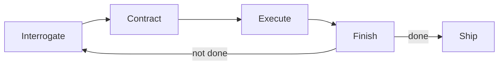

# rHarness

> **Finish First.**

**rHarness** is a local-first, plugin-based AI agent harness. Give it a task and it runs a
repeatable **finish-first** loop — *Interrogate → Contract → Execute → Finish* — until the work
verifiably meets its own success criteria, then stops. It ships as a browser web app (chat with
the agent + manage plugins), a CLI, and a TypeScript core, with a companion Rust workspace for the
engine and built-in plugins.

- **Local-first** — runs entirely on your machine; works offline in demo mode, no account required.
- **Plugin-based** — five built-in plugins (filesystem, shell, memory, web-search, code-executor); add your own.
- **Finish-first loop** — a bounded autonomous loop that keeps going *until done*, with a hard iteration cap.
- **Open & MIT-licensed.**

---

## The finish-first loop

Instead of stopping after a single pass, rHarness iterates through four phases and re-runs the loop
while success criteria are unmet (bounded by `max_iterations`):

1. **Interrogate** — clarify intent, surface assumptions and unknowns.
2. **Contract** — write down goals, non-goals, success criteria, and a plan.
3. **Execute** — do the work using the available plugins.
4. **Finish** — verify against the contract's success criteria; if not met, loop again.



---

## Getting started

**Prerequisites:** [Bun](https://bun.sh) ≥ 1.1 (Bun 1.4.2 recommended). Node 18+ is supported for
`node`-targeted builds. Rust/Cargo is only needed to build the companion workspace.

```bash
# 1. Install dependencies
bun install

# 2. (Optional) Configure a provider — otherwise rHarness runs in offline demo mode
cp .env.example .env

# 3. Start the local web app
bun run dev
# → opens at http://127.0.0.1:4321  (launch page)
# → http://127.0.0.1:4321/dashboard (control deck: chat, plugins, runs)
```

`bun run dev` starts the server with watch mode and, on supported platforms, opens your browser
automatically. Use `bun run start` for a non-watch run.

---

## CLI (`rh`)

rHarness exposes a `rh` command (wired as the `rh` bin in `package.json`, backed by `src/cli.ts`):

```bash
rh serve [--port 4321] [--host 127.0.0.1]   # start the local web app
rh run <task>                                # run the finish-first loop once and print the result
rh run --local <profile-id> <task>           # run the loop using a local-model profile
rh plugins                                   # list built-in plugins and their capabilities
rh config                                    # print the effective configuration
rh init                                      # write a sample rharness.json
rh local list                                # list local-model profiles
rh local status <id>                         # probe a local server's /models
rh local start  <id> [--no-launch]           # start + wait for a local server
rh local stop   <id>                         # stop a local server
rh local test   <id>                         # send a test completion
rh local use  <id>                           # print env exports to point the harness at a profile
rh --help                                    # show help
```

Without a local `rh` on your PATH, run it directly:

```bash
bun src/cli.ts serve
bun src/cli.ts run "Refactor the auth module and add tests"
bun src/cli.ts plugins
```

---

## Scripts

| Script            | Command                              | Description                                |
| ----------------- | ------------------------------------ | ------------------------------------------ |
| `bun run dev`     | `bun --watch src/index.ts`           | Start the web app (watch mode)             |
| `bun run start`   | `bun src/index.ts`                   | Start the web app                          |
| `bun run serve`   | `bun src/cli.ts serve`               | Start the web app via the CLI              |
| `bun run rh`      | `bun src/cli.ts`                     | Invoke the `rh` CLI                        |
| `bun run build`   | `bun build ... --outdir dist`        | Bundle the server entry for Node           |
| `bun run typecheck` | `bunx tsc --noEmit`                | Type-check the TypeScript codebase         |
| `bun run test`    | `bun test`                           | Run tests                                  |

---

## Plugins

Five built-in plugins ship with rHarness. Each declares the phases it participates in and the tools
it exposes, and can be enabled/disabled from the dashboard or the registry API:

| Plugin          | Phases                                | Tools                                                        |
| --------------- | ------------------------------------- | ------------------------------------------------------------ |
| `filesystem`    | Interrogate, Contract, Execute, Finish | `read_file`, `write_file`, `list_dir`, `glob`, `stat`        |
| `shell`         | Execute                               | `run_shell` (hard timeout)                                    |
| `memory`        | all phases                            | `memory.get/set/list/clear`                                   |
| `web-search`    | Interrogate, Contract, Execute         | `web.search`                                                  |
| `code-executor` | Execute, Finish                        | `run.code` (node/bun/python3/bash, hard timeout)              |

### Adding a plugin

Implement the `Plugin` interface in `src/core/types.ts` and register it with the `PluginRegistry`:

```ts
import { createHarness, registerBuiltinPlugins } from "./core/index.js";

const harness = createHarness({ /* options */ });
registerBuiltinPlugins(harness.registry);

// your own plugin:
harness.registry.register({
  id: "my-plugin",
  name: "My Plugin",
  version: "0.1.0",
  description: "Does a thing",
  capabilities: { phases: ["Execute"], tools: ["my.tool"] },
  async run(ctx) { /* ... */ return { phase: ctx.phase, success: true, output: "done" }; },
});
```

The registry API: `register`, `unregister`, `get`, `all`, `enabledPlugins`, `forPhase`,
`setEnabled`, `isEnabled`, `info`.

---

## API

The Bun web server (`src/web/server.ts`) exposes a small JSON API:

| Method | Route                       | Body / Notes                                              | Returns                         |
| ------ | --------------------------- | --------------------------------------------------------- | ------------------------------- |
| `GET`  | `/api/health`               | —                                                         | `{ ok, name, version, tagline, loop, provider, model, plugins }` |
| `GET`  | `/api/state`                | —                                                         | current harness state           |
| `POST` | `/api/chat`                 | `{ messages: [{ role, content }] }`                       | `{ ok, run_id, reply }`         |
| `POST` | `/api/run`                  | `{ task, working_dir?, max_iterations? }`                 | `{ ok, run }` (a `HarnessRun`)  |
| `GET`  | `/api/plugins`              | —                                                         | `{ plugins: PluginInfo[] }`     |
| `POST` | `/api/plugins`              | `{ id, enabled }`                                         | updated plugin list             |
| `POST` | `/api/runs/:id/cancel`      | —                                                         | cancel signal                   |

Static assets are served from `assets/`; `/` is the launch page and `/dashboard` (and `/app`) is the
control deck.

---

## Local models (EXL3 / GGUF / NVFP4)

rHarness is built to drive a **locally-served** model through its OpenAI-compatible endpoint.
Any server that speaks `/v1/chat/completions` works — vLLM (EXL3 / NVFP4), Ollama / llama.cpp
(GGUF), tabbyAPI, LM Studio, and so on. No custom API is required.

Three profiles ship out of the box, matching the checkpoints in `~/models` (see
`src/core/localmodel.ts`):

| id                 | model                                        | endpoint                | model id (served)                    |
| ------------------ | -------------------------------------------- | ----------------------- | ------------------------------------ |
| `glm53-exl3-spark` | GLM-5.3-Flash EXL3-TR3 2.0bpw (custom loader) | `127.0.0.1:18080/v1`  | `glm-5.3-flash-exl3-k2-single-spark` |
| `qwen38-exl3`      | Qwen3.8-Flash-Next EXL3 3.0bpw               | `127.0.0.1:18081/v1`    | `qwen3.8-flash-next-exl3`            |
| `qwen38-ollama`    | Qwen3.8-27B via Ollama (live)                | `127.0.0.1:11434/v1`    | `qwen3.8:27b`                        |

> EXL3 is **not** served by stock vLLM. The GLM-5.3-TR3 checkpoint uses the 0xSero
> rank-stacked custom loader (image `ghcr.io/0xsero/glm53-flash-exl3-k2-rankstacked-tp1`);
> the Qwen3.8-Next EXL3 checkpoint uses an ExLlamaV3 `tabbyapi` build. Edit a profile's
> `start`/`stop` to point at whichever launcher you actually use, or set no `start` and
> launch the server yourself.

### Manage a local server from the CLI

```
rh local list                       # show the built-in profiles
rh local status <id>                # probe <id>/models and report running / latency
rh local start  <id> [--no-launch]  # run the profile's `start` cmd, then poll until healthy
rh local stop   <id>                # run the profile's `stop` cmd
rh local test   <id>                # send a tiny completion and show the reply
rh local use    <id>                # print RHA_BASE_URL / RHA_MODEL (+ GLM thinking knobs)
```

Set `cwd` (and optionally `env`) on a profile to point at your recipe checkout. A profile with no
`start` command is fine — launch the server yourself and rHarness simply talks to the endpoint.

### One-shot: run a task against a local profile

Skip the manual `export` step entirely:

```
rh local start  glm53-exl3-spark            # bring the server up
rh run --local glm53-exl3-spark "Refactor the auth module and add tests"
```

Or use the bundled script that handles the probe → start → wait → run flow in one command:

```
scripts/local-model.sh --list                                        # list profiles
scripts/local-model.sh glm53-exl3-spark "Refactor the auth module and add tests"
```

### Point the harness at a local model

Local endpoints (`127.0.0.1`, `localhost`, …) need **no API key** — rHarness detects a local base
URL and uses the OpenAI-compatible provider instead of the offline demo.

```
export RHA_BASE_URL=http://127.0.0.1:18080/v1
export RHA_MODEL=glm-5.3-flash-exl3-k2-single-spark
# RHA_API_KEY is not needed for a local endpoint
```

### GLM-5.3 thinking / reasoning knobs

GLM-5.3 puts chain-of-thought in a `reasoning` field and accepts thinking controls in the request
body. rHarness reads `reasoning` automatically (falling back to `content`) and forwards these:

| Variable             | Purpose                                             |
| -------------------- | --------------------------------------------------- |
| `RHA_ENABLE_THINKING` | `true`/`false` → `chat_template_kwargs.enable_thinking` |
| `RHA_REASONING_EFFORT`| `low` / `high` → `reasoning_effort`                |
| `RHA_MAX_TOKENS`     | keep ≥ `32768` while thinking is on                 |

### Sampling & inference tuning

These knobs are forwarded to the local server. Servers that don't support a given field simply
ignore it, so it's safe to set them on any OpenAI-compatible endpoint.

| Variable             | Default | Purpose                                              |
| -------------------- | ------- | ---------------------------------------------------- |
| `RHA_TOP_P`          | *(unset)* | `top_p` — cumulative probability threshold (0–1)  |
| `RHA_TOP_K`          | *(unset)* | `top_k` — top-K candidate tokens (EXL3 / llama.cpp) |
| `RHA_SYSTEM_PROMPT`  | *(built-in)* | system / role prompt applied to every conversation |
| `RHA_MAX_CONTEXT`    | *(unset)* | `max_model_len` — max context window (input+output) tokens |
| `RHA_GPU_OFFLOAD`    | *(unset)* | `n_gpu_layers` — GPU-offloaded layers (`-1` = all) |
| `RHA_CPU_THREADS`    | *(unset)* | `n_threads` — CPU thread pool size                  |
| `RHA_FLASH_ATTENTION`| *(unset)* | `use_flash_attn` — `true` to enable Flash Attention |
| `RHA_RESPONSE_FORMAT`| *(unset)* | `json_object` — force structured JSON output        |

### Web API

The dashboard server exposes the same manager over JSON:

```
GET  /api/local                  # list profiles
GET  /api/local/:id/status       # probe a server
POST /api/local/:id/start        # start + wait for healthy
POST /api/local/:id/stop         # stop
POST /api/local/:id/test         # send a test completion
```

---

## Configuration

Configuration is resolved from environment variables (see `.env.example`). **No real credentials are
required** — with no `RHA_API_KEY` set *and* a non-local `RHA_BASE_URL`, rHarness uses a
deterministic offline `DemoProvider`.

| Variable             | Default                                   | Purpose                              |
| -------------------- | ----------------------------------------- | ------------------------------------ |
| `RHA_API_KEY`        | *(empty → demo mode for remote endpoints)* | API key for an OpenAI-compatible provider |
| `RHA_BASE_URL`       | `https://api.openai.com/v1`              | OpenAI-compatible endpoint (remote **or** local) |
| `RHA_MODEL`          | `gpt-4o-mini`                             | Model identifier                     |
| `RHA_MAX_TOKENS`     | `32768`                                   | Max completion tokens                |
| `RHA_ENABLE_THINKING`| *(unset)*                                 | `chat_template_kwargs.enable_thinking` (GLM-5.3) |
| `RHA_REASONING_EFFORT`| *(unset)*                                 | `low` / `high` → `reasoning_effort` (GLM-5.3) |
| `RHA_TOP_P`          | *(unset)*                                 | `top_p` — cumulative probability threshold     |
| `RHA_TOP_K`          | *(unset)*                                 | `top_k` — top-K candidate tokens               |
| `RHA_SYSTEM_PROMPT`  | *(built-in)*                              | System prompt / role definition                |
| `RHA_MAX_CONTEXT`    | *(unset)*                                 | `max_model_len` — max context window (tokens)  |
| `RHA_GPU_OFFLOAD`    | *(unset)*                                 | `n_gpu_layers` — GPU-offloaded layers          |
| `RHA_CPU_THREADS`    | *(unset)*                                 | `n_threads` — CPU thread pool size             |
| `RHA_FLASH_ATTENTION`| *(unset)*                                 | `use_flash_attn` — enable Flash Attention      |
| `RHA_RESPONSE_FORMAT`| *(unset)*                                 | `json_object` — force JSON output              |
| `RHA_PORT`           | `4321`                                    | Web server port                      |
| `RHA_HOST`           | `127.0.0.1`                               | Web server host                      |
| `RHA_MEMORY_FILE`    | `~/.rharness/memory.json`                 | Persistent store for the memory plugin |

`rharness.json` holds the harness identity (name, tagline, loop, phases, plugins).

---

## Project structure

```
rHarness/
├── src/                 # TypeScript core (runs under Bun)
│   ├── index.ts         #   entry point (server + optional browser)
│   ├── cli.ts           #   `rh` CLI
│   ├── core/            #   types, providers, finish-first loop, harness, registry
│   ├── plugins/         #   built-in plugins (filesystem, shell, memory, web-search, code-executor)
│   └── web/server.ts    #   Bun.serve web app + JSON API
├── assets/              # launch page (index.html, launch.css) + dashboard (dashboard.html, styles.css, app.js)
├── crates/              # Rust workspace (companion engine + plugins)
│   ├── core/            #   engine, types
│   ├── agents/          #   agent base
│   ├── plugins/         #   Rust built-in plugins
│   ├── web/             #   Rust web server
│   └── cli/             #   Rust CLI
├── Cargo.toml           # Rust workspace root
├── package.json         # Bun/npm package + scripts + `rh` bin
├── rharness.json        # harness identity/config
├── .env.example         # environment template (no secrets)
└── tsconfig.json
```

### Rust workspace

The Rust workspace mirrors the TypeScript core and builds cleanly:

```bash
cargo check --workspace   # type-check all crates
cargo build --workspace   # build
```

---

## Security notes

- Runs locally, bound to `127.0.0.1` by default — do not expose the host to untrusted networks without
  adding authentication.
- The `shell` and `code-executor` plugins execute commands and scripts inside the working directory with a
  hard timeout; treat the working directory as trusted.
- Never commit a real `.env`. Only `.env.example` is tracked.

---

## License

MIT. See [LICENSE](./LICENSE).
