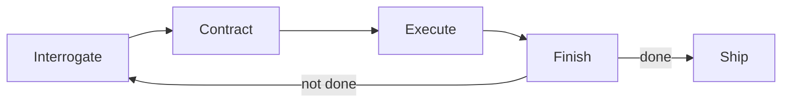

# rHarness

> **Finish First.**

**rHarness** is a local-first, plugin-based AI agent harness. Give it a task and it runs a
repeatable **finish-first** loop — *Interrogate → Contract → Execute → Finish* — until the work
verifiably meets its own success criteria, then stops. It ships as a browser web app (chat with
the agent + manage plugins), a CLI, and a TypeScript core, with a companion Rust workspace for the
engine and built-in plugins.

- **Local-first** — runs entirely on your machine; works offline in demo mode, no account required.
- **Plugin-based** — five built-in plugins (filesystem, shell, memory, web-search, code-executor); add your own.
- **Finish-first loop** — a bounded autonomous loop that keeps going *until done*, with a hard iteration cap.
- **Open & MIT-licensed.**

---

## The finish-first loop

Instead of stopping after a single pass, rHarness iterates through four phases and re-runs the loop
while success criteria are unmet (bounded by `max_iterations`):

1. **Interrogate** — clarify intent, surface assumptions and unknowns.
2. **Contract** — write down goals, non-goals, success criteria, and a plan.
3. **Execute** — do the work using the available plugins.
4. **Finish** — verify against the contract's success criteria; if not met, loop again.



---

## Getting started

**Prerequisites:** [Bun](https://bun.sh) ≥ 1.1 (Bun 1.4.2 recommended). Node 18+ is supported for
`node`-targeted builds. Rust/Cargo is only needed to build the companion workspace.

```bash
# 1. Install dependencies
bun install

# 2. (Optional) Configure a provider — otherwise rHarness runs in offline demo mode
cp .env.example .env

# 3. Start the local web app
bun run dev
# → opens at http://127.0.0.1:4321  (launch page)
# → http://127.0.0.1:4321/dashboard (control deck: chat, plugins, runs)
```

`bun run dev` starts the server with watch mode and, on supported platforms, opens your browser
automatically. Use `bun run start` for a non-watch run.

---

## CLI (`rh`)

rHarness exposes a `rh` command (wired as the `rh` bin in `package.json`, backed by `src/cli.ts`):

```bash
rh serve [--port 4321] [--host 127.0.0.1]   # start the local web app
rh run <task>                                # run the finish-first loop once and print the result
rh plugins                                   # list built-in plugins and their capabilities
rh config                                    # print the effective configuration
rh init                                      # write a sample rharness.json
rh --help                                    # show help
```

Without a local `rh` on your PATH, run it directly:

```bash
bun src/cli.ts serve
bun src/cli.ts run "Refactor the auth module and add tests"
bun src/cli.ts plugins
```

---

## Scripts

| Script            | Command                              | Description                                |
| ----------------- | ------------------------------------ | ------------------------------------------ |
| `bun run dev`     | `bun --watch src/index.ts`           | Start the web app (watch mode)             |
| `bun run start`   | `bun src/index.ts`                   | Start the web app                          |
| `bun run serve`   | `bun src/cli.ts serve`               | Start the web app via the CLI              |
| `bun run rh`      | `bun src/cli.ts`                     | Invoke the `rh` CLI                        |
| `bun run build`   | `bun build ... --outdir dist`        | Bundle the server entry for Node           |
| `bun run typecheck` | `bunx tsc --noEmit`                | Type-check the TypeScript codebase         |
| `bun run test`    | `bun test`                           | Run tests                                  |

---

## Plugins

Five built-in plugins ship with rHarness. Each declares the phases it participates in and the tools
it exposes, and can be enabled/disabled from the dashboard or the registry API:

| Plugin          | Phases                                | Tools                                                        |
| --------------- | ------------------------------------- | ------------------------------------------------------------ |
| `filesystem`    | Interrogate, Contract, Execute, Finish | `read_file`, `write_file`, `list_dir`, `glob`, `stat`        |
| `shell`         | Execute                               | `run_shell` (hard timeout)                                    |
| `memory`        | all phases                            | `memory.get/set/list/clear`                                   |
| `web-search`    | Interrogate, Contract, Execute         | `web.search`                                                  |
| `code-executor` | Execute, Finish                        | `run.code` (node/bun/python3/bash, hard timeout)              |

### Adding a plugin

Implement the `Plugin` interface in `src/core/types.ts` and register it with the `PluginRegistry`:

```ts
import { createHarness, registerBuiltinPlugins } from "./core/index.js";

const harness = createHarness({ /* options */ });
registerBuiltinPlugins(harness.registry);

// your own plugin:
harness.registry.register({
  id: "my-plugin",
  name: "My Plugin",
  version: "0.1.0",
  description: "Does a thing",
  capabilities: { phases: ["Execute"], tools: ["my.tool"] },
  async run(ctx) { /* ... */ return { phase: ctx.phase, success: true, output: "done" }; },
});
```

The registry API: `register`, `unregister`, `get`, `all`, `enabledPlugins`, `forPhase`,
`setEnabled`, `isEnabled`, `info`.

---

## API

The Bun web server (`src/web/server.ts`) exposes a small JSON API:

| Method | Route                       | Body / Notes                                              | Returns                         |
| ------ | --------------------------- | --------------------------------------------------------- | ------------------------------- |
| `GET`  | `/api/health`               | —                                                         | `{ ok, name, version, tagline, loop, provider, model, plugins }` |
| `GET`  | `/api/state`                | —                                                         | current harness state           |
| `POST` | `/api/chat`                 | `{ messages: [{ role, content }] }`                       | `{ ok, run_id, reply }`         |
| `POST` | `/api/run`                  | `{ task, working_dir?, max_iterations? }`                 | `{ ok, run }` (a `HarnessRun`)  |
| `GET`  | `/api/plugins`              | —                                                         | `{ plugins: PluginInfo[] }`     |
| `POST` | `/api/plugins`              | `{ id, enabled }`                                         | updated plugin list             |
| `POST` | `/api/runs/:id/cancel`      | —                                                         | cancel signal                   |

Static assets are served from `assets/`; `/` is the launch page and `/dashboard` (and `/app`) is the
control deck.

---

## Configuration

Configuration is resolved from environment variables (see `.env.example`). **No real credentials are
required** — with no `RHA_API_KEY` set, rHarness uses a deterministic offline `DemoProvider`.

| Variable          | Default                                   | Purpose                              |
| ----------------- | ----------------------------------------- | ------------------------------------ |
| `RHA_API_KEY`     | *(empty → demo mode)*                     | API key for an OpenAI-compatible provider |
| `RHA_BASE_URL`    | `https://api.openai.com/v1`              | OpenAI-compatible endpoint           |
| `RHA_MODEL`       | `gpt-4o-mini`                             | Model identifier                     |
| `RHA_PORT`        | `4321`                                    | Web server port                      |
| `RHA_HOST`        | `127.0.0.1`                               | Web server host                      |
| `RHA_MEMORY_FILE` | `~/.rharness/memory.json`                 | Persistent store for the memory plugin |

`rharness.json` holds the harness identity (name, tagline, loop, phases, plugins).

---

## Project structure

```
rHarness/
├── src/                 # TypeScript core (runs under Bun)
│   ├── index.ts         #   entry point (server + optional browser)
│   ├── cli.ts           #   `rh` CLI
│   ├── core/            #   types, providers, finish-first loop, harness, registry
│   ├── plugins/         #   built-in plugins (filesystem, shell, memory, web-search, code-executor)
│   └── web/server.ts    #   Bun.serve web app + JSON API
├── assets/              # launch page (index.html, launch.css) + dashboard (dashboard.html, styles.css, app.js)
├── crates/              # Rust workspace (companion engine + plugins)
│   ├── core/            #   engine, types
│   ├── agents/          #   agent base
│   ├── plugins/         #   Rust built-in plugins
│   ├── web/             #   Rust web server
│   └── cli/             #   Rust CLI
├── Cargo.toml           # Rust workspace root
├── package.json         # Bun/npm package + scripts + `rh` bin
├── rharness.json        # harness identity/config
├── .env.example         # environment template (no secrets)
└── tsconfig.json
```

### Rust workspace

The Rust workspace mirrors the TypeScript core and builds cleanly:

```bash
cargo check --workspace   # type-check all crates
cargo build --workspace   # build
```

---

## Security notes

- Runs locally, bound to `127.0.0.1` by default — do not expose the host to untrusted networks without
  adding authentication.
- The `shell` and `code-executor` plugins execute commands and scripts inside the working directory with a
  hard timeout; treat the working directory as trusted.
- Never commit a real `.env`. Only `.env.example` is tracked.

---

## License

MIT. See [LICENSE](./LICENSE).
